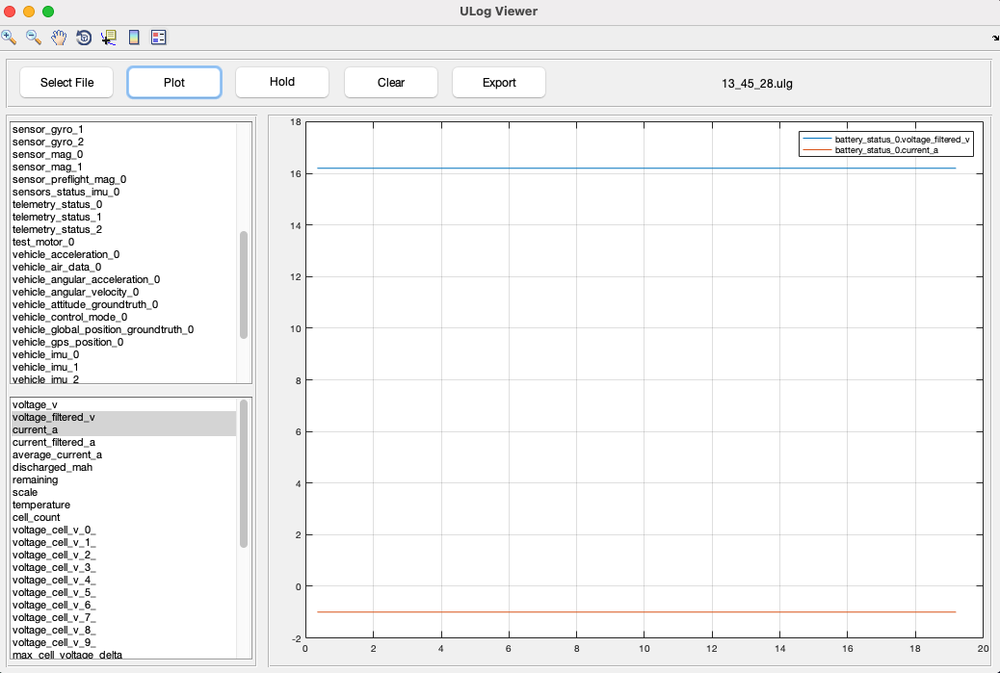

# Simple Matlab GUI to View PX4 ULog Files



This GUI was created using GUIDE in Matlab 2017a. It is fairly simple, it can only plot the time histories of message fields. To process the ULog file, [pyulog](https://github.com/PX4/pyulog) is used.

## Getting Started

- Install [pyulog](https://github.com/PX4/pyulog) using pip first (as explained on that page).

- Make sure it has installed `ulog2csv` correctly (check the output of `which ulog2csv` in Linux/MacOS or `where ulog2csv` in Windows).

- Change the following line in `ulogviewver.m`:

```
handles.ulog2csv = '/opt/anaconda3/bin/ulog2csv';
```
The above path should correctly point to the `ulog2csv` binary installed by `pyulog`.

- Make sure this repository folder is available in Matlab path and type `ulogviewer` to launch the GUI.

- Click on 'Select File' button to select a `.ulg` file. The GUI will call `ulog2csv` to convert the ulog file into multiple CSV files, and then load the data from those CSV files.

- Once the data is loaded, the upper listbox contains all the messages found. You can select one message in this box.

- For the selected message, the lower listbox shows all the fields. You can select multiple of these fields and click 'Plot' to plot them. 